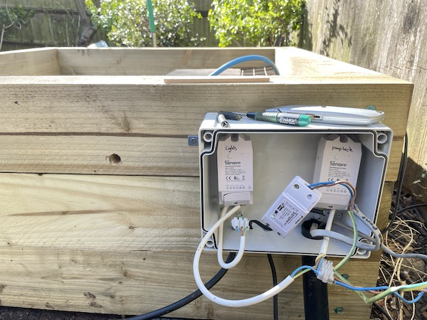
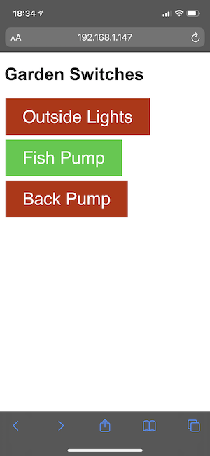

# sonoff_mqtt_switch
The goal of this project was to control some Sonoff switches setup with Espurna via MQTT. Whilst you can log in to the devices themselves and use the switch on the Espurna webpage, I wanted to be able to control a few devices from one interface without having to log in.

The sonoff devices themselves were setup using the instructions on the [CASA_CE workshop page](https://workshops.cetools.org/codelabs/sonoffpowr2/) and are installed in a garden controlling 3 items - 2 pumps and an array of outside lights.

Sonoff Switches

The web page uses the [Paho MQTT Javascript library](https://www.eclipse.org/paho/index.php?page=clients/js/index.php) to connect via websockets to the [Mosquitto](https://mosquitto.org) broker on my local network. The web page allows me to show all three devices as 3 simple switches which toggle the state of the devices.

Screenshot of web app

Turning lights on / off
